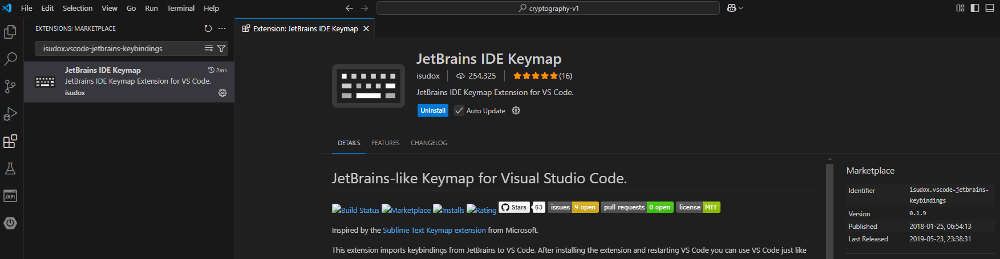
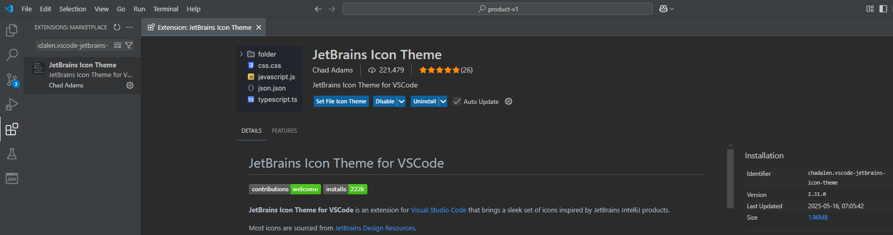
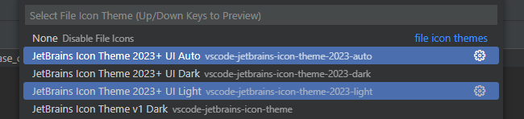
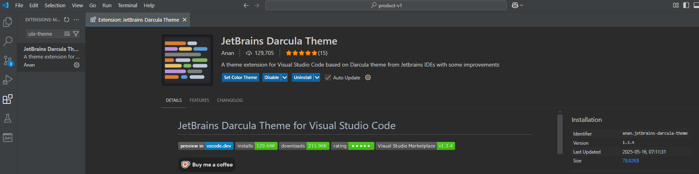
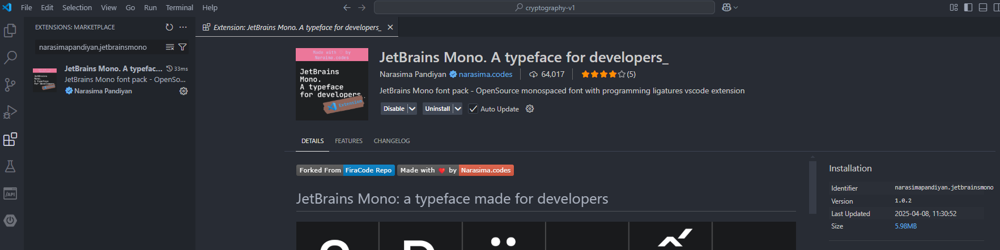
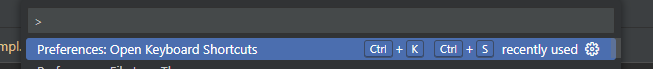
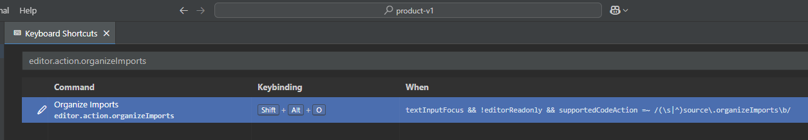

# ESTILO JETBRAINS

[← Regresar a notas](../../README.md) <br>

---
[1. Instalar plugins](#1-instalar-plugins) <br>
[2. Settings.json](#2-settingsjson) <br>

---

## 1. Instalar plugins

> > ### ⚙️ JetBrains IDE Keymap
> 
> - Identifier: `isudox.vscode-jetbrains-keybindings` <br>
> - Plugin para shortcuts
>
> 

> > ### ⚙️ JetBrains Icon Theme
> - Identifier: `chadalen.vscode-jetbrains-icon-theme` <br>
> - Plugin para íconos
> 
> 
> 
> 📌 **Nota**: En caso no se haya establecido por defecto, entonces abra la paleta de comandos `ctrl+shift+p`, selecciona `Preferences: File Icon Theme` y a continuación `JetBrains Icon Theme v1 Dark`.
> 
> 

> > ### ⚙️ JetBrains Darcula Theme
> - Identifier: `anan.jetbrains-darcula-theme`
> - Plugin para tema oscuro
> 
> 
> 📌 **Nota**: En caso no se haya establecido por defecto, entonces abra la paleta de comandos `ctrl+shift+p`, selecciona `Color Theme` y a continuación, `JetBrains Darcula Theme`.

> > ### ⚙️ JetBrains Mono
> - Identifier: `narasimapandiyan.jetbrainsmono`
> - Plugin para fuente de texto
> 
> 
> 
> 📌 **Nota**: El plugin descargará las fuentes en `C:\Users\<user>\.vscode\extensions\narasimapandiyan.jetbrainsmono-1.0.2\JetBrainsMono`. A continuación, instalarlas en `Windows/Fonts`.

## 2. Settings.json
```json
{
  "keyboard.dispatch": "keyCode", //shortcuts
  "workbench.colorTheme": "JetBrains Darcula Theme",
  "files.autoSave": "onFocusChange", // autosave
  "editor.fontFamily": "JetBrains Mono, Fira Code, Consolas, 'Courier New', monospace",
  "editor.fontLigatures": true // change this kind of symbols "->" 
}
```

## 3. Organizar los imports
- Abrir la paleta de comandos `ctrl+shift+p`, selecciona `Preferences: Open Keyboard Shortcuts`.



- Buscar `editor.action.organizeImports` y personalizar `Shift + Alt + O`.



## 4. Build Project
Abrir la paleta de **Build Tasks** `ctrl + (Fn + F9)` y seleccionar el build que corresponda para compilar todas las carpetas y capturar errores de sintaxis o dependencias.
