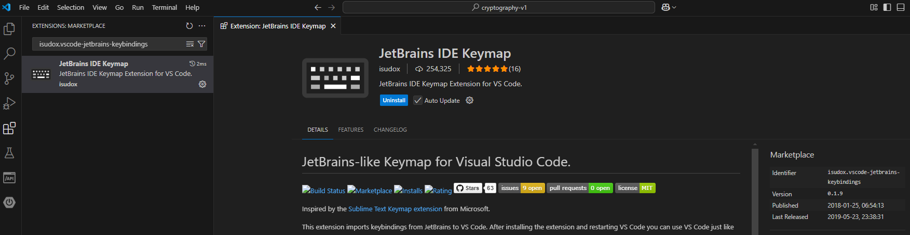
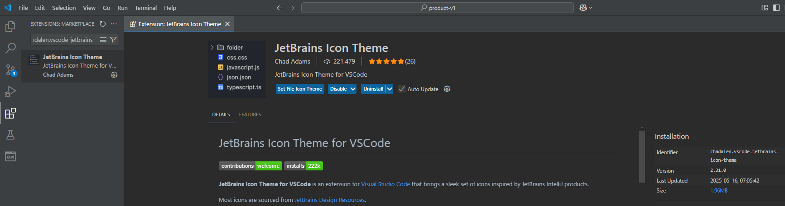
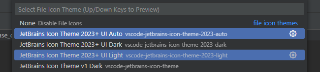
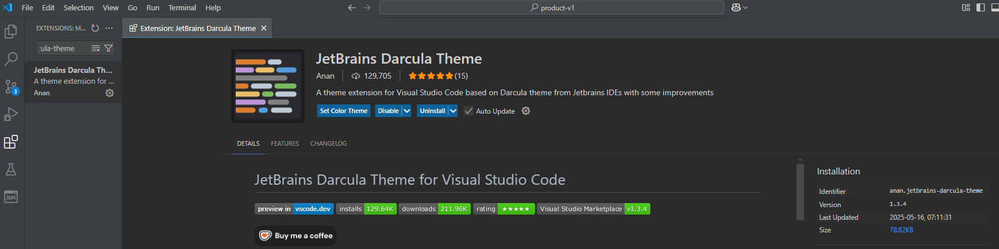
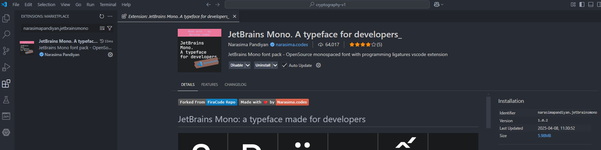
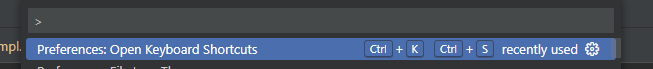
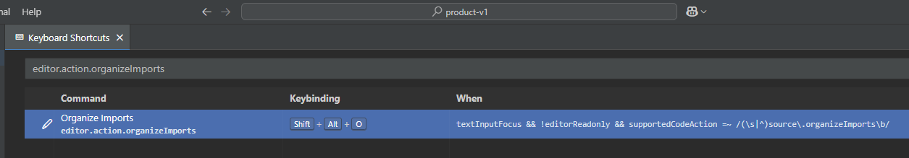

# Configuración general

[← Regresar](../../README.md)  

---
[1. Instalar extensiones](#1-instalar-extensiones)  
[2. Configurar settings.json](#2-settingsjson)  
[3. Organizar imports](#3-organizar-imports)  

---

## 1. Instalar extensiones

> > ### 🟢 JetBrains IDE Keymap
> > `isudox.vscode-jetbrains-keybindings`  
> > Shortcuts
>
> 

> > ### 🟢 JetBrains Icon Theme
> > `chadalen.vscode-jetbrains-icon-theme`  
> > Íconos
> 
> 
> 
> Si no se establece por defecto, abrir la paleta de comandos `ctrl+shift+p`, seleccionar `Preferences: File Icon Theme` y a continuación `JetBrains Icon Theme v1 Dark`.
> 
> 

> > ### 🟢 JetBrains Darcula Theme
> > `anan.jetbrains-darcula-theme`  
> > Tema oscuro
> 
> 
> Si no se establece por defecto, abrir la paleta de comandos `ctrl+shift+p`, seleccionar `Color Theme` y a continuación, `JetBrains Darcula Theme`.

> > ### 🟢 JetBrains Mono
> > `narasimapandiyan.jetbrainsmono`  
> > Fuente de texto
> 
> 
> 
> El plugin descargará las fuentes en `C:\Users\<user>\.vscode\extensions\narasimapandiyan.jetbrainsmono-1.0.2\JetBrainsMono`. A continuación, copiarlas en `Windows/Fonts`.

## 2. Settings.json

> [.vscode/Settings.json](Settings.json)

## 3. Personalizar shortcuts

> > ### 🟢 Organizar imports
> - Abrir la paleta de comandos `ctrl+shift+p`, seleccionar `Preferences: Open Keyboard Shortcuts`.
> 
>   
>
> 
> - Buscar `editor.action.organizeImports` y personalizar `Shift + Alt + O`.
> 
>   

