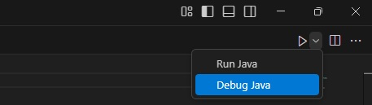

# CONFIGURACIÓN PARA JAVA

[← Regresar a notas](../../README.md)  

---
[2. Instalar plugins](#2-instalar-plugins)  

---

## 1. Prerrequisitos
- Instalar JDK y configurar variable de entorno JAVA_HOME
- Instalar Maven y configurar variable de entorno MVN_HOME

## 2. Instalar plugins

### Extensión para Java
`vscjava.vscode-java-pack`

### Extensión para Spring Boot
`vmware.vscode-boot-dev-pack`

## 3. Ejecutar aplicación

