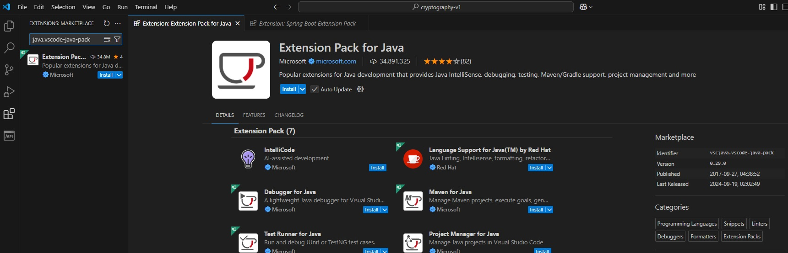
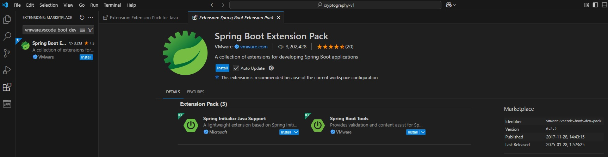
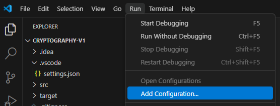
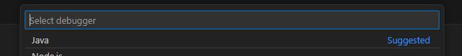
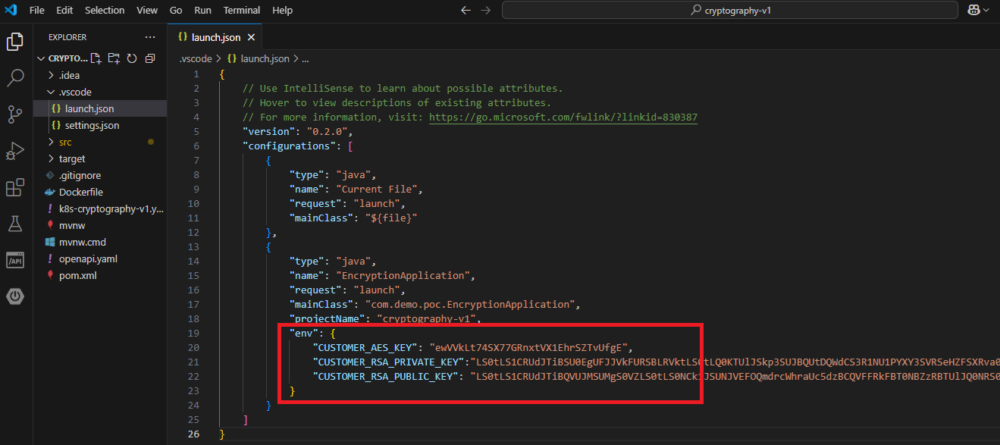
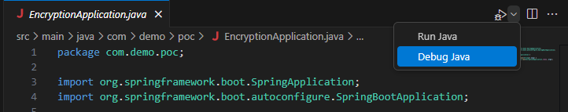
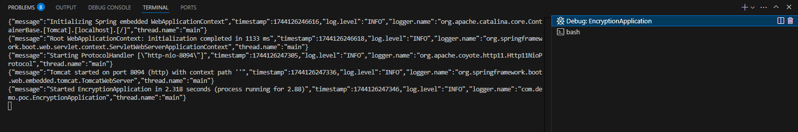
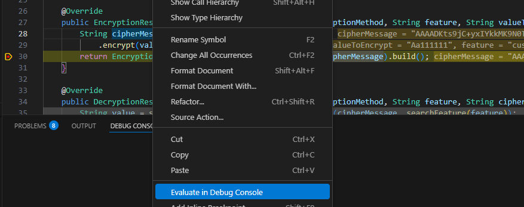
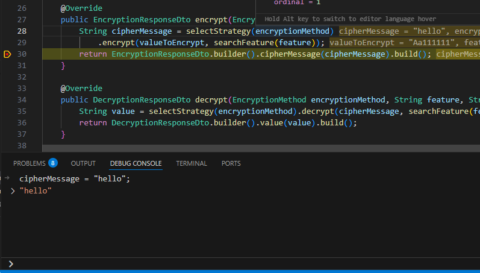

# CONFIGURACIÓN PARA JAVA

[← Regresar a notas](../../README.md) <br>

---
[1. Instalar plugins](#1-instalar-plugins) <br>
[2. Settings.json](#2-settingsjson) <br>
[2. Launch.json](#3-launchjson) <br>
[4. Ejecutar aplicación](#4-ejecutar-aplicación) <br>

---

## 1. Instalar plugins

> > ### ⚙️ Extensión para Java
> Identifier: `vscjava.vscode-java-pack`
> 
> 

> ### ⚙️ Extensión para Spring Boot
> Identifier: `vmware.vscode-boot-dev-pack`
> 
> 

---

## 2. Settings.json

```json
{
  "maven.executable.preferMavenWrapper": false, // don't use mvw
  "maven.executable.path": "D:\\dev-environment\\maven\\apache-maven-3.9.6\\bin\\mvn", // local mvn installation
  "maven.terminal.customEnv": [
    {
        "environmentVariable": "JAVA_HOME",
        "value": "D:\\dev-environment\\java\\jdk-17"
    }
  ]
}
```

---

## 3. Launch.json

> Seleccionar "Add configuration"
>
> 

> Seleccionar "Java"
>
> 

> Agregar las variables de entorno
>
> 

---

## 4. Ejecutar aplicación

> 
>
> 

---

## 5. Debug

> Dar clic derecho sobre la variable y seleccionar "Evaluate in Debug Console"
>
> 

> Evaluar la expresión
>
> 