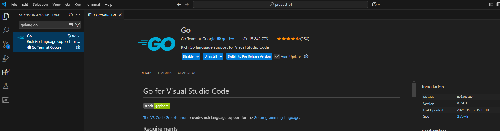

# Configuración para GO

[← Regresar](../../README.md)  

---
[1. Instalar extensiones](#1-instalar-extensiones)  
[2. Configurar settings.json](#2-settingsjson)  
[3. Configurar tasks.json](#3-tasksjson)  
[4. Configurar launch.json](#4-launchjson)  

---

## 1. Instalar extensiones

> > ### 🟢 Go
> > `golang.go`  
>
> 

## 2. Settings.json
> [.vscode/Settings.json](Settings.json)

## 3. Tasks.json
> [.vscode/tasks.json](tasks.json)

## 4. Launch.json
> [.vscode/launch.json](launch.json)